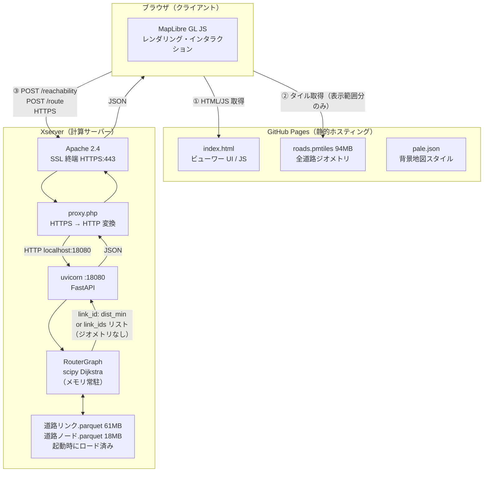
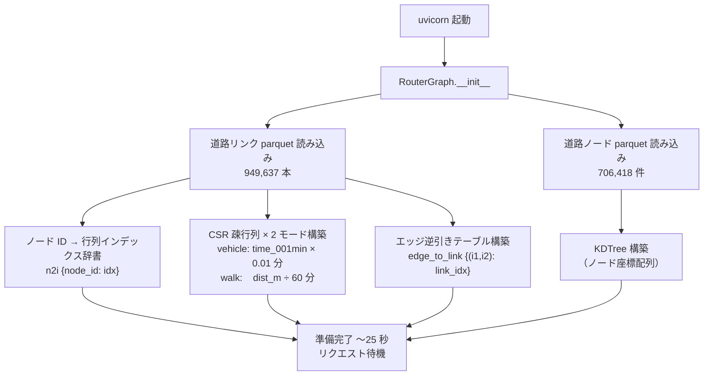
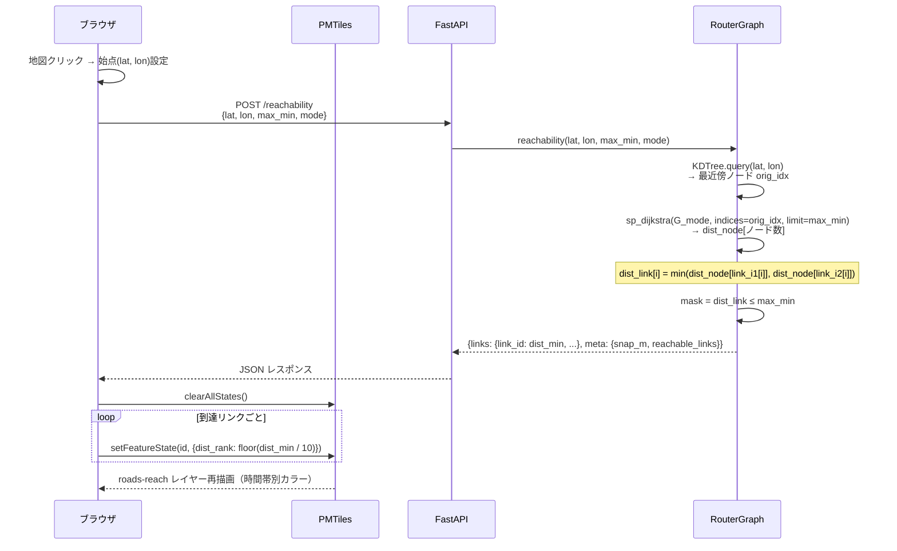
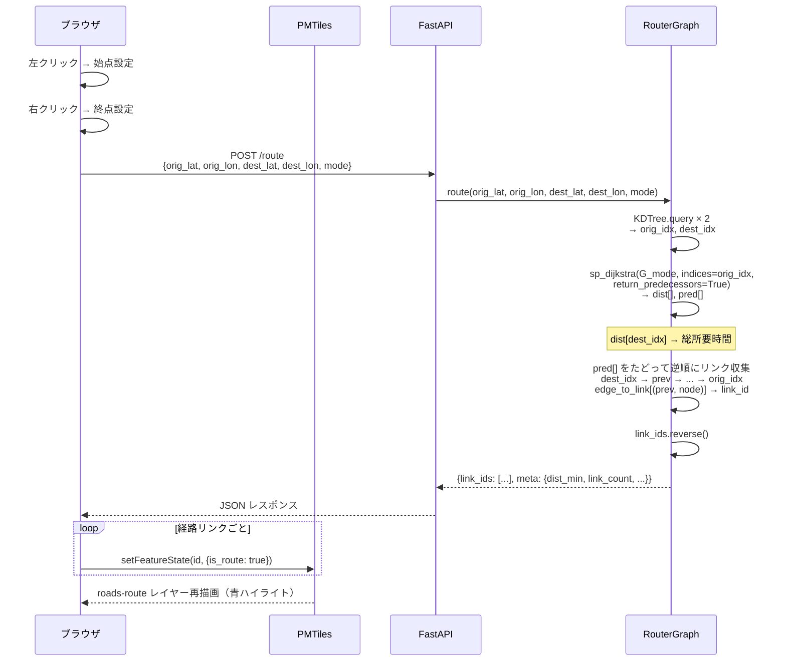
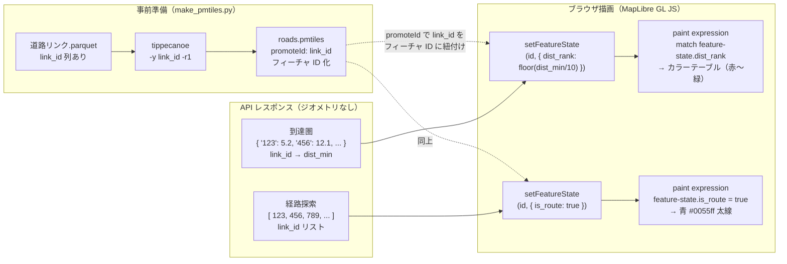

# Route Search API

国土数値情報（KSJ）道路データを使った経路探索・到達圏 Web ビューワー・API。

道路データ：国土数値情報 道路データ / 測量法に基づく国土地理院長承認（使用）R 8JHs 85

---

## ビューワーの使い方

```
https://shiwaku.github.io/ksj-route-search-api/?api=https://shiworks2.xsrv.jp/api
```

FastAPI サーバーの URL を `?api=` パラメータで指定する。デプロイ手順は [SERVER_DEPLOY.md](SERVER_DEPLOY.md) を参照。

### 操作方法

| 操作 | 内容 |
|---|---|
| 左クリック | 始点を設定（緑マーカー） |
| 右クリック | 終点を設定（赤マーカー・経路探索タブ） |
| 「到達圏を表示」 | 始点から N 分以内の道路を色分け表示 |
| 「経路を表示」 | 始点→終点の最短経路を表示 |
| 「クリア」 | 表示結果をリセット |

---

## API エンドポイント（API サーバーモード時）

| エンドポイント | 説明 |
|---|---|
| `GET /healthz` | 死活確認 |
| `POST /reachability` | 始点から N 分以内の到達圏（道路リンク単位） |
| `POST /route` | 最短経路（始点→終点） |

### POST /reachability

```json
{ "lat": 35.8578, "lon": 139.6490, "max_min": 30, "mode": "vehicle" }
```

レスポンス: `{ "links": {"link_id": dist_min, ...}, "meta": {...} }`

`mode`: `"vehicle"`（車）または `"walk"`（徒歩 3.6 km/h）

### POST /route

```json
{ "orig_lat": 35.8578, "orig_lon": 139.6490,
  "dest_lat": 36.0420, "dest_lon": 139.4006, "mode": "vehicle" }
```

レスポンス: `{ "link_ids": [123, 456, ...], "meta": { "dist_min": 53.4 } }`

---

## アーキテクチャ

### インフラ役割分担



| | GitHub Pages | Xserver |
|---|---|---|
| 役割 | 静的ファイル配信 | Dijkstra 計算 |
| 常時稼働 | 不要（GitHub 管理） | uvicorn プロセス必要 |
| 主なファイル | index.html / roads.pmtiles | 道路リンク/ノード .parquet |
| HTTPS | GitHub 自動付与 | Apache + PHP プロキシで対応 |

---

### 起動時の初期化



---

### グラフのライフサイクル

```
uvicorn 起動コマンド実行（SSH で手動 or cron）
    └─ RouterGraph.__init__（〜25 秒）← ここだけコストが高い
           └─ yield → ポート 18080 でリクエスト待機
                  │
                  │  プロセスが生き続ける間、グラフはメモリに常駐
                  │
                  ├─ POST /reachability → Dijkstra（0.07 s）
                  ├─ POST /reachability → Dijkstra（0.07 s）
                  └─ ...

Xserver 再起動 / pkill uvicorn
    └─ グラフ消滅 → 再度起動コマンドが必要
```

**ネットワークデータの差し替え手順**（現状・ホットリロード非対応）

```bash
# ① 新しい parquet を転送
scp -P 10022 新しい道路リンク.parquet user@sv16193.xserver.jp:~/ksj-route-search-api/network/saitama/

# ② uvicorn を停止
pkill -f "uvicorn src.main:app"

# ③ 再起動（グラフ再構築 〜25 秒）
nohup uvicorn src.main:app --host 0.0.0.0 --port 18080 > ~/api.log 2>&1 &
```

再起動中はサービス停止になる。停止を避けるには `/admin/reload` エンドポイントの追加が必要（未実装）。

---

### 到達圏（POST /reachability）



---

### 経路探索（POST /route）



---

### 計算結果の可視化の仕組み

API はジオメトリを返さない。PMTiles に事前格納されたジオメトリを `link_id` で引いて色付けする設計。



| 方式 | レスポンス内容 | サイズ | 速度 |
|---|---|---|---|
| ジオメトリあり（GeoJSON） | 全リンクの座標を含む | 数十 MB | 遅い |
| **本実装（link_id のみ）** | `{"123": 5.2, "456": 12.1, ...}` | **約 2 MB** | **約 0.6 s** |

---

## ローカル起動

```bash
# 依存インストール
pip install -r requirements.txt

# ネットワークデータを配置（gitignored）
# network/saitama/ に道路リンク・ノード parquet を置く

# PMTiles 生成（初回のみ・tippecanoe 必要）
python3 src/make_pmtiles.py

# サーバー起動
uvicorn src.main:app --host 0.0.0.0 --port 8080

# ビューワー（API モード）
# ブラウザで http://localhost:8080/?api=http://localhost:8080 を開く
```

---

## ファイル構成

```
docs/
  index.html        ビューワー（GitHub Pages）
  pale.json         背景地図スタイル（国土地理院）
  roads.pmtiles     道路ネットワーク PMTiles（94MB・表示用）

src/
  main.py           FastAPI アプリ
  graph.py          RouterGraph（scipy Dijkstra）
  make_pmtiles.py   道路リンク parquet → PMTiles 変換
  benchmark.py      ライブラリ別速度比較

network/saitama/    gitignored（要配置）
  KSJ_N13-24_saitama_all_道路リンク.parquet  (61MB)
  KSJ_N13-24_saitama_all_道路ノード.parquet  (18MB)
```

---

## ネットワークデータの生成

```bash
# 国土数値情報（N13-24）GeoJSON から生成:
python3 src/ksj_to_network_csv.py \
  --meshes 5338,5339,5438,5439 --case saitama_all --pref 埼玉県
# ※ GeoJSON は https://nlftp.mlit.go.jp/ksj/ からダウンロード
```

| ファイル | 内容 |
|---|---|
| `KSJ_N13-24_saitama_all_道路リンク.parquet` | 949,637 本（全道路・フィルターなし） |
| `KSJ_N13-24_saitama_all_道路ノード.parquet` | 706,418 件 |

---

## パフォーマンス（saitama_all・埼玉県）

| 処理 | 時間 | 内訳 |
|---|---|---|
| 起動時 parquet 読み込み | 約 7.6 s | 1 回のみ |
| 起動時グラフ構築 | 約 17 s | 1 回のみ（CSR行列・KDTree・edge_to_link） |
| **起動時合計** | **約 25 s** | |
| `/reachability` vehicle 30 分 | **約 0.6 s** | Dijkstra 0.07 s + JSON シリアライズ 0.5 s |
| `/route` vehicle | **約 0.1 s** | |

リクエストごとのボトルネックは **Dijkstra（0.07 s）ではなく JSON シリアライズ（0.5 s）**。到達リンク最大 27 万件の `{link_id: dist_min}` dict 組み立てが支配的。`orjson` 等の高速シリアライザへの置き換えで改善余地あり。

---

## リンクへの到達時間の持たせ方

Dijkstra はノード単位で最短距離を求める。リンク（エッジ）への到達時間は **両端ノードのうち近い方の到達時間** を採用している。

```python
d1 = dist_node[link_i1]   # node1 への到達時間
d2 = dist_node[link_i2]   # node2 への到達時間
dist_link = min(d1, d2)   # 小さい方を採用
```

```
始点 ──10分── [node1] ──3分── [node2]
                 └────── link ──────┘

d1 = 10分、d2 = 13分
dist_link = min(10, 13) = 10分
→ node1 に到達した時点でこのリンクを「到達済み」とみなす
```

すなわち **「そのリンクに踏み込める最短時間」** をリンクの到達時間として持たせている。リンクを走り切った（遠端に到達した）時間ではない。

### 他ツールとの比較

| ツール | リンク到達時間の扱い |
|---|---|
| **本実装** | `min(d_node1, d_node2)`（両端の近い方） |
| **pgRouting** `pgr_drivingDistance` | ノード単位で返却。エッジ着色時は `min(cost_node1, cost_node2)` が一般的 → **同じ** |
| **Valhalla** isochrone | 有向グラフで辺の始端コストを使用 → 有向版の `min(d1, d2)` に相当 → **概念は同じ** |

本実装は全道路を双方向（無向）として扱うため、有向グラフを前提とする Valhalla とは厳密には異なるが、「エントリーノードへの到達時間をリンクのコストとする」考え方は共通している。

---

## Xserver へのデプロイ

詳細は [SERVER_DEPLOY.md](SERVER_DEPLOY.md) を参照。

---

## サーバー更新手順

コードを変更して push した後、Xserver 側で以下を実行する。

### 通常の更新（コード変更のみ）

```bash
ssh -p 10022 shiworks2@sv16193.xserver.jp
cd ~/ksj-route-search-api
git pull
pkill -f "uvicorn src.main:app"
nohup uvicorn src.main:app --host 0.0.0.0 --port 18080 > ~/api.log 2>&1 &
```

### パッケージ追加時（requirements.txt を変更した場合）

```bash
git pull
pip install -r requirements.txt
pkill -f "uvicorn src.main:app"
nohup uvicorn src.main:app --host 0.0.0.0 --port 18080 > ~/api.log 2>&1 &
```

### 起動確認

グラフ構築に約 25 秒かかるため、起動後に待ってから確認する。

```bash
sleep 30 && curl -s http://localhost:18080/healthz
# → {"status":"ok","graph_loaded":true}
```

### ログ確認

```bash
tail -f ~/api.log
```

---

## 道路リンク速度設定

速度は `ksj_to_network_csv.py` でネットワークデータ生成時に `time_001min` 列として書き込まれる。

### vehicle モード（道路種別別）

| N13_003 | 道路種別 | 速度 |
|---|---|---|
| 1 | 国道 | 35 km/h |
| 2 | 都道府県道 | 30 km/h |
| 3 | 市区町村道等 | 20 km/h |
| 4 | 高速自動車国道等 | 80 km/h |
| 5 | その他 | 20 km/h |
| 6 | 不明 | 20 km/h |

### walk モード（一律）

| 対象 | 速度 |
|---|---|
| 全リンク | 3.6 km/h（デフォルト）|

walk 速度は `ksj_to_network_csv.py` の `--walk-kmh` オプションで変更可能。

### コスト計算式

```
time_001min = max(1, round(dist_m / speed_kmh * 6.0))  # 0.01分単位
走行時間 (分) = time_001min × 0.01
```

### parquet カラムと速度の関係

道路リンク parquet には `time_001min`（vehicle 用）と `dist_m` の両方が格納されている。API サーバー（`graph.py`）は起動時にそれぞれを読み込んで 2 モード分の CSR 行列を構築する。

| カラム | 内容 | 使うモード |
|---|---|---|
| `dist_m` | リンク長（m） | walk モードのコスト計算元 |
| `time_001min` | 道路種別別速度で計算した所要時間（0.01 分単位） | vehicle モード |

walk モードの所要時間は parquet には焼き込まれておらず、`graph.py` が `dist_m ÷ 60` でリアルタイム計算する。

### 速度を変更するには

**現状**：速度は parquet 生成時に焼き込まれるため、変更には parquet の再生成が必要。

```bash
# ① ksj_to_network_csv.py の SPEED_KMH を編集
# ② 再生成
python3 ksj_to_network_csv.py --meshes 5338,5339,5438,5439 --case saitama_all --pref 埼玉県
# ③ scp で転送 → uvicorn 再起動
```

**改善案**：`dist_m` と `N13_003` から `graph.py` 側で走行時間を計算する設計にすれば、速度テーブルの変更は `graph.py` の修正 + uvicorn 再起動のみで済む（parquet 再生成不要）。

---

## 制約

- **一方通行未考慮**: 国土数値情報に一方通行フィールドなし（全道路双方向）
- **対象エリア**: デフォルトは埼玉県（saitama_all）
