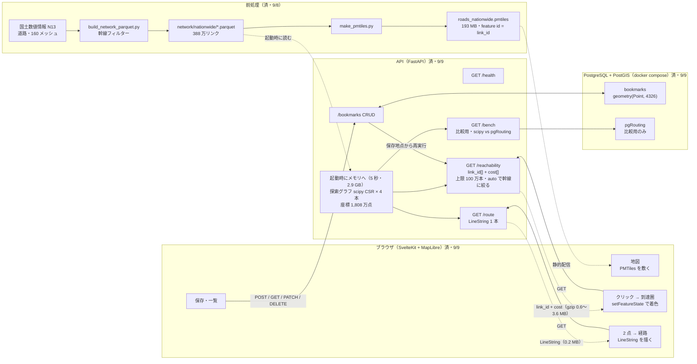

# API 設計書

Route Search API（全国道路ネットワークの到達圏分析・経路探索）

| | |
|---|---|
| 版 | 0.4（2026-09-10・`/bench` を実装し未確定 ④ を決定。0.3 は 2026-09-09・到達圏の実用範囲を描画・ヒープまで実測し、上限・`road_class`・`use_expressway`・スナップ・gzip を確定） |
| ベース URL | `http://localhost:8000`（開発） |
| 形式 | JSON / UTF-8 |
| 認証 | なし（本 API では扱わない） |
| 自動生成仕様 | FastAPI の `/docs`（Swagger UI）・`/openapi.json` |

**この文書は「何を提供するか」と「技術をどう選んだか（8 章・ADR）」。**

---

## 0. 構成図



破線が設計の芯: 探索グラフは起動時にメモリへ載せ（1-3）、道路の形は PMTiles で配って API は `link_id` だけ返す（1-1）。

---

## 1. 設計方針

### 1-1. 到達圏レスポンスにジオメトリを返さない

全国・東京駅・30分の到達圏は **123,945 リンク**。素直に GeoJSON で返すと約 25 MB になる。

| 方式 | サイズ | 判定 |
|---|---|---|
| GeoJSON（LineString を全部返す） | 約 25 MB（概算） | ✕ |
| `{"12345": 12.34, ...}` の dict | 約 2.5 MB（概算） | △ キー名の引用符が全体の 3 割 |
| **`link_ids[]` + `costs[]` の並列配列** | **1.86 MB / gzip 0.54 MB**（実測） | ✅ 採用 |

実測（東京駅・全国 388万リンク・2026-09-08）:

| 打ち切り | 到達リンク | 生 | gzip |
|---|---|---|---|
| **30 分**（既定） | 135,269 | **1.86 MB** | **0.54 MB** |
| 60 分 | 395,474 | 5.48 MB | 1.58 MB |
| 120 分 | 786,335 | 11.05 MB | 3.19 MB |

**gzip を必ず有効にする**（`GZipMiddleware(compresslevel=1)`）。3.4 倍効く。**圧縮レベルは 1**（2-3b）。

道路の形は **PMTiles（全国 193 MB・z6-13）** として静的に配信し、
API は `link_id` とコストだけを返す。クライアントは受け取った配列を
MapLibre の `setFeatureState` でタイル側のリンクに載せて着色する。

> 利用者が欲しいのは「どこまで行けるか」であって道路の座標ではない。
> 座標は静的なので探索のたびに送る必要がなく、タイルとして配ればよい（ブラウザは見ている範囲のタイルだけを都度取る）。

### 1-2. 経路だけはジオメトリを返す

経路は LineString 1 本で数百 KB に収まるため、そのまま返す。
**到達圏と経路で扱いを変えているのは意図的**で、レスポンスの大きさが判断基準。

### 1-3. 探索グラフは in-memory、PostgreSQL はアプリデータ

実測で pgRouting は到達圏で 10〜27 倍（エッジを bbox で絞る実務的な使い方。30 分 0.3 秒・上限 480 分 3.4 秒 vs scipy 17 ms・216 ms）・経路探索で 12.5 倍遅く（結果は完全一致）、
差はアルゴリズムではなくグラフの置き場所から来ていた。
→ 探索は scipy（プロセス常駐 0.96 GB）、PostgreSQL/PostGIS はブックマークを持つ。

---

## 2. 共通仕様

### 2-1. コスト単位

| `cost` | 単位 | 備考 |
|---|---|---|
| `time`（既定） | **分**（小数） | 内部は 0.01 分単位の整数。API 境界で分に直して返す |
| `dist` | **メートル** | |

### 2-2. スナップ

始点・終点は最近傍の道路ノードへスナップされる。
**スナップ後の座標と距離を必ずレスポンスに含める**（利用者がクリック地点との
ずれを把握できないと、結果が正しいのか判断できないため）。

**スナップ対象は連結成分のサイズが 1,000 ノード以上のノードに限る。**
全国グラフは幹線フィルターの副作用で 28,817 の連結成分に割れており、県庁の目の前の道が
2〜4 ノードの孤島になっている箇所がある（水戸県庁・岐阜県庁で実測）。そこにスナップすると
「到達 2 リンク」が 200 で返り、利用者は気づけない。しきい値 1,000 で残るのは 14 成分・全ノードの 96.3%
（本州＋四国＋九州 / 北海道 / 沖縄 / 主な離島）。成分計算は起動時に 66 ms。

### 2-3. エラー

| HTTP | `detail` | 発生条件 |
|---|---|---|
| 422 | FastAPI 既定の検証エラー | 必須パラメータ欠落・型不正 |
| 400 | `緯度経度が日本の範囲外です` | 対象データ外の座標 |
| 404 | `ブックマークが見つかりません` | 存在しない `id` |
| 400 | `到達リンクが上限 1,000,000 本を超えました（2,442,087 本）。road_class=trunk なら 1,128,314 本、major なら 326,406 本` | `road_class` を明示指定して 100 万本超。`auto` なら発生しない |
| 422 | FastAPI 既定の検証エラー | `limit_min` が 1〜1,920 の範囲外、`road_class` が不正 |
| 503 | `グラフを読み込み中です` | 起動から数秒（グラフ 3.5 秒＋成分計算）のロード完了前 |

到達不能（道路網が繋がっていない）は**エラーではなく正当な結果**なので 200 で返す（`/route` 参照）。

```jsonc
{"detail": "グラフを読み込み中です"}
```

### 2-3b. ミドルウェア

| | 設定 |
|---|---|
| gzip | **必須・`compresslevel=1`**。到達圏に 3.4 倍効く（12.62 → 3.76 MB）。既定の lv9 は 120 分で **1,790 ms**（サーバー側の 88%）、lv1 は **45 ms** でサイズ +15%。 |
| CORS | 開発は SvelteKit の `http://localhost:5173` を許可 |

### 2-4. 起動時のロード

全国グラフの構築は **3.5 秒**（実測）、連結成分の計算は 66 ms、高速なし用の第 2 重み配列は 0.41 秒（+62 MB）。FastAPI の lifespan で起動時に 1 回だけ組み、
完了までは探索系エンドポイントが 503 を返す。クライアントは `/health` を見て待つ。

> 初期の比較で測った **23.7 秒は全列を読んだ値**。探索に要るのは
> `node1` / `node2` / コスト列だけで、**ジオメトリ列（290 MB の WKB）を読まなければ 3.5 秒**。
> pgRouting の利点だった「起動が実質ゼロ」との差は 23.7 秒ではなく 3.5 秒しかない。

---

## 3. 探索系エンドポイント

### `GET /health`

グラフのロード状況。**フロントは起動直後にこれをポーリングする。**

```jsonc
{
  "status": "ok",           // "ok" | "loading"
  "graph_loaded": true,
  "links": 3881601,
  "nodes": 3710962,
  "snap_nodes": 3574581,     // スナップ対象（成分サイズ 1,000 以上）
  "components": 28817,
  "coordinates": 18082985,   // /route 用の座標点数（float32 常駐・145 MB）
  "load_seconds": 5.1,
  "uptime_seconds": 412.5
}
```

### `GET /reachability`

指定地点からの到達圏を、到達した道路リンクの一覧として返す。

| パラメータ | 型 | 必須 | 既定 | 説明 |
|---|---|---|---|---|
| `lat` | float | ✅ | | 始点の緯度 |
| `lon` | float | ✅ | | 始点の経度 |
| `limit_min` | float | | **`120`** | 打ち切り。**1〜1,920**（東京起点は 1,200 分、鹿児島起点は 1,800 分で本州・四国・九州の全域に到達。道路網の直径は佐多岬→大間崎 1,891 分）。`cost=dist` のときはメートル |
| `cost` | `time`\|`dist` | | `time` | コストの種類 |
| `road_class` | `auto`\|`all`\|`trunk`\|`major` | | **`auto`** | 返す道路種別。下表 |
| `use_expressway` | bool | | `true` | `false` で高速道路（`N13_003=4`）を通行不可にする。結果からも高速リンクを除く |

| `road_class` | 対象（`N13_003`） | 意味 |
|---|---|---|
| `all` | 全部 | フィルター後の全リンク |
| `trunk` | 1・2・4 | 高速＋国道＋都道府県道 |
| `major` | 1・4 | 高速＋国道 |
| **`auto`** | — | **all → trunk → major の順に試し、到達リンクが 100 万本以下になった最初の種別で返す** |

```jsonc
// GET /reachability?lat=35.681&lon=139.767&limit_min=480
{
  "origin": {"lat": 35.681, "lon": 139.767},
  "snap":   {"lat": 35.6812, "lon": 139.7665, "dist_m": 205.1},
  "limit_min": 480,
  "cost": "time",
  "road_class": "auto",
  "use_expressway": true,
  "road_class_applied": "major",   // all 2,442,087 → trunk 1,128,314 → major 326,406 本で確定
  "tier": "ok",                    // "ok"(〜40 万本) | "heavy"(40〜100 万本)
  "count": 326406,
  "elapsed_ms": 230.0,
  "link_ids": [12, 15, 19],        // 昇順
  "costs":    [0.4, 0.9, 1.2]      // 分。link_ids と同じ並び・同じ長さ
}
```

`link_ids` と `costs` は**必ず同じ長さ**で、同じ添字が対応する。
`road_class_applied` と `tier` は**何を返したかを利用者に告げる**ためのもので、
フロントは `heavy` で「広域のため幹線のみ表示」の注記を出す。

#### 高速道路あり / なし

`use_expressway=false` は、高速リンクの重みを `inf` にした**第 2 の重み配列**で探索する
（CSR の構造は共有、起動時に 0.41 秒・+62 MB、クエリ時のコストはゼロ）。
リンクの到達判定は「両端ノードのどちらかが到達」なので、IC の両側が一般道で到達していると間の高速リンクが
到達に見える → **高速なしの結果からは高速リンクを明示的に除く**。

| 東京駅 | 高速あり | 高速なし | →大阪 |
|---|---|---|---|
| 120 分 | 786,335 本・72 ms | 431,842 本・42 ms | 377 分 → 883 分 |

高速なしは常に軽いので、下の 3 段階はそのまま適用できる。

#### 上限が「分」ではなく「本数」である理由

到達リンク数がブラウザのヒープ（**561 バイト/リンク**、MapLibre `setFeatureState` の実測）と
描画時間を決める。同じ分でも道路密度で 2〜4 倍違う（盛岡 240 分 = 35 万本は東京 120 分 = 79 万本の半分以下）。
想定端末（RAM 8 GB のノート → ヒープ上限約 2 GB）から逆算して **100 万本**を上限にした。

| 段階 | 到達リンク | ヒープ増 | 色が乗るまで（localhost） |
|---|---|---|---|
| 🟢 `tier: "ok"` | 〜40 万 | 〜225 MB | 〜0.5 秒 |
| 🟡 `tier: "heavy"` | 40〜100 万 | 〜560 MB | 〜1.3 秒 |
| 🔴 返さない | 100 万超 | 560 MB〜 | 1.3 秒〜（480 分 all は 1.7〜2.3 秒・1.5 GB） |

| 起点 | 分 | all | trunk | major |
|---|---|---|---|---|
| 東京駅 | 120 | 🟡 786,335 | 🟢 319,052 | 🟢 81,070 |
| | 240 | 🔴 1,223,820 | 🟡 543,596 | 🟢 150,235 |
| | 480 | 🔴 2,442,087 | 🔴 1,128,314 | 🟢 326,406 |
| 名古屋駅 | 480 | 🔴 2,610,050 | 🔴 1,277,643 | 🟢 362,197 |
| 盛岡駅 | 240 | 🟢 351,114 | 🟢 163,623 | 🟢 58,062 |
| | 480 | 🔴 1,386,575 | 🟡 617,455 | 🟢 181,426 |

**480 分は `major` なら全起点で 🟢**。上限は当初 480 だったが、2026-09-10 に実測して **1,920 分**に広げた: 東京駅起点は 1,200 分、鹿児島中央起点は 1,800 分で本州・四国・九州の全リンク 3,434,005 本に到達して以後増えない。道路網の直径（最も遠い 2 点）は佐多岬→大間崎 1,891 分・2,249 km。`major` は上限で 508,385 本（🟡・100 万本以内）、API 270〜280 ms。1,920 = 80 分刻み × 24 帯。北海道・沖縄は別の道路網なので届かない。

### `GET /route`

2 地点間の最短経路。

| パラメータ | 型 | 必須 | 既定 |
|---|---|---|---|
| `from_lat` / `from_lon` | float | ✅ | |
| `to_lat` / `to_lon` | float | ✅ | |
| `cost` | `time`\|`dist` | | `time` |
| `use_expressway` | bool | | `true` |

```jsonc
{
  "geometry": {"type": "LineString", "coordinates": [[139.76596, 35.68267]]},   // 実測 19,113 点・gzip 0.22 MB
  "summary": {"dist_m": 497564, "time_min": 377.2, "link_count": 1527},         // 東京駅→大阪府庁 実測（2026-09-09）
  "snap": {"origin_m": 205.1, "dest_m": 73.4},
  "cost": "time", "use_expressway": true,
  "unreachable_reason": null,
  "elapsed_ms": 268.0
}
```

経路が存在しない場合は **200** で `geometry` を `null`、`summary.link_count` を `0`、
`unreachable_reason` に理由を入れる。**到達不能はエラーではなく正当な結果**。

```jsonc
// GET /route?from_lat=35.681&from_lon=139.767&to_lat=43.068&to_lon=141.350  （東京駅→札幌駅）
{
  "geometry": null,
  "summary": {"dist_m": 0, "time_min": 0, "link_count": 0},
  "snap": {"origin_m": 205.1, "dest_m": 60.3},
  "unreachable_reason": "始点と終点が別の道路網に属しています（本州＋四国＋九州 / 北海道）",
  "elapsed_ms": 270.0
}
```

全国グラフは道路で繋がっていない成分に分かれている: 本州＋四国＋九州（3,263,147 ノード）・
北海道（248,601。青函トンネルは鉄道のみ）・沖縄（29,857）・離島。
スナップは成分サイズ 1,000 以上に限るので（2-2）、それ以外の到達不能は起きない。
参考実測: 東京駅→大阪府庁 377.2 分・→福岡県庁 821.6 分、全探索 256〜270 ms（距離に依らない）。

### `GET /bench`

**比較用。** 同一条件で scipy と pgRouting を叩き、比較表を返す。本番の探索には使わない（ADR-1 の根拠をその場で再現する）。
実装は `api/bench.py`。比較が成り立つのは、`api/graph.py` と `preprocess/export_for_pgrouting.py` が
ノード番号を同じ方法（`np.unique` → 0 始まりの連番）で振っているから。

| パラメータ | 型 | 既定 |
|---|---|---|
| `lat` / `lon` | float | 東京駅 |
| `limit_min` | float | `30`（1〜1,920） |
| `verify` | bool | `true`。到達**ノード集合**の一致まで確かめる（pgRouting をもう 1 回叩くので応答は約 2 倍） |
| `bbox` | bool | `false`。`true` で pgRouting のエッジ SQL を `geom && ST_MakeEnvelope(...)`（半径 = 80 km/h × 打ち切り）で絞る。実務的な使い方との比較用。レスポンスの `pgrouting_edges` にどちらで測ったかが入る |

`count` は到達**ノード**数（リンク数ではない。pgr_drivingDistance がノードを返すため）。
`elapsed_ms` は scipy が Dijkstra 本体、pgRouting が `count(*)` クエリ 1 本の往復。

```jsonc
{
  "snap":      {"lat": 35.68267, "lon": 139.76596, "dist_m": 206.6, "node": 2077846},
  "limit_min": 30,
  "scipy":     {"elapsed_ms": 19.4,   "count": 123945},
  "pgrouting": {"elapsed_ms": 3461.8, "count": 123945},
  "identical": true,       // verify=false なら null
  "ratio": 178.0
}
```

DB が落ちているときは 503 にせず、`scipy` は返して `pgrouting` に `{"error": "..."}` を入れる（7 章 ④）。
比較用テーブル `roads_jp`（388 万行・geom 付き 1.0 GB・btree 2 本 + GiST）は `preprocess/load_pgrouting_table.sh` で compose の DB に投入する（README）。

---

## 4. アプリデータ系エンドポイント（PostgreSQL / PostGIS）

### テーブル

```sql
CREATE TABLE bookmarks (
  id         serial PRIMARY KEY,
  name       text NOT NULL,
  memo       text,
  geom       geometry(Point, 4326) NOT NULL,
  limit_min  integer NOT NULL DEFAULT 120,  -- 保存時の探索条件も一緒に持つ（既定は /reachability と揃える）
  use_expressway boolean NOT NULL DEFAULT true,   -- 高速あり / なし
  created_at timestamptz NOT NULL DEFAULT now(),
  updated_at timestamptz NOT NULL DEFAULT now()
);
CREATE INDEX bookmarks_geom_idx ON bookmarks USING gist (geom);
```

`geom` を PostGIS の `geometry(Point, 4326)` にすることで `ST_AsGeoJSON` で
そのまま FeatureCollection を組み立てられ、将来の空間検索にも伸ばせる。

### エンドポイント

| メソッド | パス | 成功 | 説明 |
|---|---|---|---|
| `POST` | `/bookmarks` | 201 | 地点を保存 |
| `GET` | `/bookmarks` | 200 | 一覧（GeoJSON FeatureCollection） |
| `GET` | `/bookmarks/{id}` | 200 | 1 件（GeoJSON Feature） |
| `PATCH` | `/bookmarks/{id}` | 200 | 名前・メモ・`limit_min`・`use_expressway` の更新（座標は変えない） |
| `DELETE` | `/bookmarks/{id}` | 204 | 削除 |
| `GET` | `/bookmarks/{id}/reachability` | 200 | **保存地点から到達圏を再実行**（保存した `limit_min`・`use_expressway`・`road_class=auto`。`/reachability` と同じ形） |

```jsonc
// POST /bookmarks
{"name": "東京駅", "memo": "起点の検証用", "lat": 35.681, "lon": 139.767, "limit_min": 120, "use_expressway": true}
```

```jsonc
// GET /bookmarks
{
  "type": "FeatureCollection",
  "features": [{
    "type": "Feature",
    "id": 1,
    "geometry": {"type": "Point", "coordinates": [139.767, 35.681]},
    "properties": {
      "name": "東京駅", "memo": "起点の検証用", "limit_min": 120, "use_expressway": true,
      "created_at": "2026-09-08T16:20:00+09:00",
      "updated_at": "2026-09-08T16:20:00+09:00"
    }
  }]
}
```

一覧を GeoJSON で返すのは、MapLibre にそのまま `source` として渡せるため。

---

## 5. 静的配信

| | パス | 内容 |
|---|---|---|
| 道路タイル | `roads_nationwide.pmtiles` | 全国 **200 MB**・z6-13・レイヤ `roads`。**ズーム別に道路種別を出し分け**（z6-10 高速・国道・都道府県道 / z11- 全部）・タイル上限 1.5 MB。 |

開発では `web/static/tiles/roads_nationwide.pmtiles` → `network/nationwide/` のリンクを **Vite の静的配信**で出す
（HTTP Range に対応・206 を確認）。API は経由しない。公開版は R2 に置き、Worker が `/tiles/` で返す（`deploy-cloudflare.md` 3 章）。

タイルに載る属性は **`road_type` のみ**。`link_id` は**フィーチャ ID** に昇格させてあり、
`setFeatureState` の対象キーになる。

> ⚠️ `link_id` はリンク parquet の**行番号**という暗黙の約束で、
> `router.py` / `export_for_pgrouting.py` / `make_pmtiles.py` の 3 つが揃えている。
> ここがずれると着色が全部狂う。詳細は README「実装上の注意」。

---

## 6. 性能の目安（実測・2026-09-08）

全国 388万リンク・東京駅起点。`api/graph.py` での実測（2026-09-08）。

| 項目 | 実測 | 備考 |
|---|---|---|
| 起動時のグラフ構築 | **5.1 秒**（1 回だけ） | グラフ 3.7 秒 ＋ `/route` 用の座標 1.2 秒（v0.2 の 3.5 秒はグラフのみ） |
| 到達圏 30 分 | **30.7 ms** / 135,269 リンク | |
| 到達圏 60 分 | 42.6 ms / 395,474 リンク | |
| 到達圏 120 分 | 74.3 ms / 786,335 リンク | |
| JSON 化（30 分） | 17 ms | 探索より安い |
| 常駐メモリ（RSS） | **2.91 GB**（重み配列 4 本・成分ラベル込み。v0.2 時点は 2.07 GB） | |
| 到達圏レスポンス（30 分） | 1.86 MB / gzip 0.54 MB | |

#### 描画まで（一気通貫・2026-09-09・東京駅・gzip lv1・localhost）

Playwright headless Chromium 151 + MapLibre 5.24.0、実物の全国 PMTiles、本物のレスポンス。

| `limit_min` | 到達リンク | サーバー | `setFeatureState` | 描画 | **色が乗るまで** | JS ヒープ |
|---|---|---|---|---|---|---|
| 30 | 135,269 | 51 ms | 14 ms | 261〜362 ms | **0.35〜0.46 秒** | 131 MB |
| 120 | 786,335 | 221 ms | 80 ms | 290〜611 ms | **0.65〜0.97 秒** | 455〜640 MB |
| 480（`all`） | 2,442,087 | 674 ms | 170 ms | 757〜1,427 ms | 1.7〜2.3 秒 | **901〜1,502 MB** |

描画の幅は z6〜z9。`setFeatureState` の呼び出し自体は安く、重いのはタイルへの反映と
**保持するヒープ（561 バイト/リンク）**。描画は SwiftShader での値で、実 GPU では速めに出る。

#### ⚠️ 初期のスクリプト計測と数字が違う理由

| 項目 | 初期計測 | ここ | 理由 |
|---|---|---|---|
| 到達圏 30 分 | 11.1 ms | 30.7 ms | 初期計測は `dijkstra` 単体。ここは **388万リンクへのコスト展開込み**の API 実時間 |
| 到達数 | 123,945 | 135,269 | 初期計測は**ノード**数。API は**リンク**単位で返す |
| 起動 | 23.7 秒 | 3.5 秒 | 初期計測は全列読み込み。**ジオメトリ列を読まなければ 3.5 秒** |
| メモリ | 0.96 GB | 2.07 GB | 初期計測は `tracemalloc`（Python の割り当て分）。ここは **RSS**（scipy/numpy のバッファ込み） |

**どちらも正しいが、利用者に約束できるのは API 側の数字**なので、この文書ではそちらを採る。

#### 差分エンコードは採らない（測ったうえで）

`link_ids` を差分にすると gzip 後が**ちょうど半分**になる（30分 0.54 → 0.25 MB、
120分 3.19 → 1.53 MB）。コストを整数（0.01 分単位）にする効果は gzip 後は **0%**。

| 方式 | 30 分 gzip | 120 分 gzip |
|---|---|---|
| **絶対値の `link_ids`（採用）** | **0.54 MB** | 3.19 MB |
| 差分の `link_ids` | 0.25 MB | 1.53 MB |

**採らない理由**: 既定の 30 分が 0.54 MB で足りており、
差分配列は利用者にデコード（累積和）を強いる。
「利用者目線」で見れば、既定は素直な形が正しい。
**120 分が実運用で重ければ、この実測値を根拠に切り替える。**

---

## 7. 未確定（この文書で決めきれていないこと）

| # | 項目 | 状況 |
|---|---|---|
| ~~①~~ | ~~`/route` の LineString をどこから取るか~~ | ✅ **決定**（2026-09-09）: 案(a)。起動時に row group ごとに `shapely.from_wkb` → float32 平坦配列（1.2 秒・145 MB・1,808 万点）。1 経路の取り出し 3 ms。案(b) parquet 遅延読みは毎回 83 ms で不採用。 |
| ~~②~~ | ~~`limit_min` の上限~~ | ✅ **決定**（2026-09-09）: 上限は分ではなく到達リンク 100 万本、`road_class=auto` で自動的に落とす。`limit_min` は 1〜480・既定 120。3 章 |
| ③ | 400「日本の範囲外」の判定範囲 | 孤立断片へのスナップは 2-2 の成分制限で解消。**bbox / スナップ距離の上限は未定のまま**（海上クリックなど） |
| ~~④~~ | ~~`/bench` の DB 未起動時の挙動~~ | ✅ **決定（2026-09-10）: scipy 側だけ返し、`pgrouting` に error を入れる**（DB が落ちていても in-memory の数字は見せられる） |
| ~~⑤~~ | ~~`PATCH /bookmarks/{id}` で座標変更を許すか~~ | ✅ **決定: 許さない**（座標を変えたいなら別の地点として保存） |
| ~~⑥~~ | ~~`docker compose` への parquet の渡し方~~ | ✅ **決定（2026-09-09）: compose は DB のみ。API はホストで `uv run uvicorn`**（parquet・座標 2.9 GB をコンテナに載せる理由がローカルデモでは無い） |
| ~~⑦~~ | ~~`bookmarks` に `road_class` / `use_expressway` を持つか~~ | ✅ **決定（2026-09-09）: `use_expressway` は持つ、`road_class` は持たない**（`auto` 前提） |
| ⑨ | ノード結合の許容誤差 | メッシュ境界で端点が 1〜5 cm ずれ、45 対が別成分になっている。所要時間への影響はゼロなので**据え置き**。直すなら立体交差の誤結合対策が先 |
| ⑩ | 低ズーム（z6-7）のタイルはリンクの 5〜8 割が間引かれる | tippecanoe の 20 万フィーチャ上限と 1.5 MB 上限の両方に当たる。全部入れると 5 MB 級でパンが重くなる。**据え置き**。根本対策は縮約リンク（1-2）を低ズーム専用に使い API が縮約 ID も返すこと（今後） |
| ⑧ | 実ネットワークでの転送時間 | localhost でしか測っていない。100 万本 = gzip 約 4.8 MB は 100 Mbps で 0.4 秒、モバイル 20 Mbps で 2 秒（概算） |

---

## 8. 技術選定の記録（ADR）

各決定を「論点 → 比較した選択肢 → 決定 → 実測の根拠 → 詳細の参照」で残す。数字はすべて全国 388 万リンク・東京駅起点の実測（2026-09-08〜09）。

### ADR-1 探索エンジン: scipy（in-memory）を採用、pgRouting は比較用に残す

| 選択肢 | 到達圏 30 分 | **到達圏 480 分（上限）** | 経路 東京→大阪 | データ 12 倍で | 備考 |
|---|---|---|---|---|---|
| **scipy CSR（採用）** | **11 ms** | **212 ms** | **267 ms** | **1.2 倍** | 構築 1.3 秒・1.05 GB。並行リンクは最小値に畳む必要 |
| NetworkX | 83 ms（7 倍） | 未計測 | — | 1.05 倍 | 構築 3.5 秒・2.92 GB。破綻はしない |
| pgRouting 3.5・エッジ SQL を bbox で絞る（**実務的な使い方**） | **315 ms（19 倍）** | **3,449 ms（16 倍）** | — | — | 半径 = 80 km/h × 打ち切り。結果は scipy と**完全一致**（30 分・480 分ともノード集合で確認）。起動ゼロ・`UPDATE` 即反映 |
| pgRouting 3.5・全 388 万行を毎回読む（素朴な使い方） | 3,333 ms（300 倍） | 4,046 ms（19 倍） | 3,324 ms（12.5 倍） | **15 倍** | 初期計測の測り方。打ち切りに依らず 3.3 秒の底がある |
| OSRM / GraphHopper / Valhalla（前処理あり・2026-09-11 実測） | ポリゴンのみ（GraphHopper 4,269 ms）。リンク単位の API はない | GraphHopper は上限で拒否 | **OSRM CH 2.2 ms・GraphHopper 22 ms** | — | 前処理 OSRM CH 212 秒・GraphHopper 70 秒。KSJ → OSM PBF 変換は 36 秒（`preprocess/export_osm_pbf.py`）。詳細は `docs/routing-engines.md` |

**専用エンジン（OSRM / Valhalla / GraphHopper）との比較**（2026-09-11）: 同じ 388 万リンクを OSM PBF に変換して実測した。5 エンジンの概要・特徴・数字は **`docs/routing-engines.md`** に分離。要点だけ: 経路は専用エンジンが 1〜2 桁速いが、入力の変換層とリンク単位の到達圏 API がなく、本プロジェクトの 3 条件（自前データ × リンク単位の到達圏 × 探索の理解）から外れるため scipy を採る。

**「全行（素朴）」と「bbox で絞る（実務的）」の違い**: pgRouting に渡す「エッジを取り出す SQL」の末尾に `WHERE` が 1 つ付くかどうか。
`pgr_drivingDistance` はこの SQL の結果を**毎回全部読み込み、メモリ上にグラフを組んでから**探索するので、SQL が返す行数がそのまま作業量になる。

```sql
-- 全行（素朴）: 毎回 388 万本を読む
SELECT id, source, target, cost, reverse_cost FROM roads_jp
-- bbox（実務的）: 起点の周り（半径 = 最高速度 80 km/h × 打ち切り時間）だけ読む。30 分なら半径 40 km
SELECT id, source, target, cost, reverse_cost FROM roads_jp
 WHERE geom && ST_MakeEnvelope(139.32, 35.32, 140.21, 36.04, 4326)
```

| 東京駅・30 分 | 全行（素朴） | bbox 半径 40 km（実務的） |
|---|---|---|
| SQL が返すエッジ数 | 3,881,601 本 | 364,582 本 |
| `pgr_drivingDistance` の時間 | 3,509 ms | 208 ms |
| 到達ノード数 | 123,945 | 123,945（同じ） |

30 分で行ける範囲は 40 km を超えないので、外側の道路を読むのは無駄だった。半径は最高速度から決める安全側の見積もりなので結果は変わらない。
480 分では半径 640 km で本州のほぼ全域を含むため、全行との差が小さくなる（297 万本 vs 388 万本）。
scipy との対比では、pgRouting は「毎回組み直す量」を減らしただけで組み直すこと自体は変わらない。だから絞っても 10〜20 倍の差が残る。

API が受け付ける全域（30〜480 分）を `/bench` で通した（2026-09-10）。pgRouting は 2 通りの使い方で測った:

| 東京駅 | 30 分 | 60 分 | 120 分 | 240 分 | **480 分** |
|---|---|---|---|---|---|
| scipy | 13〜17 ms | 38 ms | 80〜93 ms | 115〜119 ms | **212〜216 ms** |
| pgRouting・bbox で絞る（実務的） | **315 ms** | 646 ms | 1,020 ms | 2,112 ms | **3,449 ms** |
| pgRouting・全行（素朴） | 3,287 ms | 3,295 ms | 3,486 ms | 3,583 ms | 4,046 ms |
| 到達ノード（3 者一致） | 123,945 | 369,453 | 742,361 | 1,160,944 | 2,313,207 |
| 比（bbox） | 19 倍 | 17 倍 | 11 倍 | 18 倍 | **16 倍** |

別起点 480 分（bbox）: 札幌 25 ms vs 662 ms（27 倍・24.8 万ノード。北海道で閉じる）、大阪 243 ms vs 4,049 ms（17 倍・242 万ノード）。

**根拠**: 差の正体は「グラフを毎回組み直すか、常駐させるか」。pgRouting は `pgr_drivingDistance` のたびにエッジ SQL の結果からグラフを組む。
全行を読めば 3.3 秒の底、bbox で絞れば読む量に比例して 0.3〜3.4 秒。scipy は起動時に 1 回組んだ CSR を使い回すので、到達ノード数に比例する 13〜216 ms だけ。
**要約すると「10〜27 倍・上限でも 0.2 秒 vs 3.4 秒」**。「300 倍」は bbox を掛けない素朴な使い方の数字で、pgRouting を不利に見せる比較だった（遅すぎる気がしたので測り直した）。
反対側の利点（起動ゼロ・`UPDATE` 即反映・SQL で完結）は変わらない。→ README。
**バージョンの注記**: 比較に使った pgRouting は 3.5.0（kartoza/postgis:15-3 同梱）。公式イメージで 3.8.0 と 4.0.1 も同じデータで測ったが、
3.6 で追加された `depth` 列の計算が到達ノード数 × 全頂点数のループになっており、全国規模では 30 分の到達圏に **6〜7 分**かかる（3.5.0 は 3.4 秒）。
全国 388 万リンクで `pgr_drivingDistance` が実用になるのは 3.5.x までで、3.5.0 との比較は pgRouting に最も有利な条件。
**構造と言語の整理**: 入力（リンク・ノード番号・コスト）は両者同一で、結果は完全一致。scipy は CSR（連続配列 3 本・Cython/C）を起動時に 1 回組んで常駐、
pgRouting は Boost Graph Library の隣接リスト（C++）をクエリごとに SQL の結果行から組み直す。差は言語ではなく、この「毎回組み直すか常駐か」から来る。
**適用範囲の整理**: pgRouting のコントリビュータは「適用範囲は市区町村レベル」と言っていたとのこと（口頭・未確認）。実測もそれと整合する:
2 次メッシュ 1 枚（7.9 万エッジ）で 37 ms、都市圏 40 km 矩形（36 万エッジ）で 315 ms、全国（388 万エッジ）で 3.3 秒と、読むエッジ数 × 約 1 µs で伸びる。
市区町村〜都市圏なら対話的に使え SQL で完結する利点が活きる。本プロジェクトが外れているのは「全国 1 グラフに繰り返し問い合わせる」用途の方で、pgRouting の欠点ではない。

**帰結**: PostgreSQL の役割は「探索」ではなく「アプリデータ（ブックマーク）」（1-3）。pgRouting は `/bench` で選定根拠として示す。

**追記（2026-09-11）: サービスとして展開してもインメモリでよいか**

結論: **読み取り専用の静的データなら、インメモリはサービス展開でも標準的な選択。** 前提と運用の作り方が変わるだけ。

- **前例**: OSRM・Valhalla・GraphHopper など経路探索エンジンの主流は道路グラフをメモリ（または mmap）に常駐させ、DB では探索しない。データ更新は「再ビルドして入れ替える」。
- **成り立つ条件は 2 つ**（本プロジェクトはどちらも満たす）:
  1. データが読み取り専用で更新頻度が低い。N13 の更新は年 1 回。渋滞・通行止めの即時反映は要件にない。
  2. 状態はメモリに置かない。ブックマークは DB にあり、API プロセスは再起動しても何も失わない（「計算はメモリ、状態は DB」の分離。複数台に増やしても矛盾しない）。
- **サービス化で変わる点と対処**:

| 論点 | 現状（ローカル） | サービスにするなら |
|---|---|---|
| メモリ 3 GB | Mac 1 台 | 1 インスタンス 4〜8 GB 級。Cloud Run / ECS Fargate なら 4 GB 以上を指定。Lambda は起動 7 秒 + parquet 380 MB の取得で不向き |
| 起動 7 秒 | 待つだけ | readiness probe を `/health` の `graph_loaded` に繋ぎ、ロード完了まで振り分けない（compose の healthcheck が既にこの形） |
| データ更新 | 手で入れ替え | parquet を S3 に置き、新バージョンで起動してから旧を落とす（ローリング更新）。年 1 回なら十分 |
| 同時アクセス | uvicorn 1 プロセス | ワーカーを増やすとメモリが n 倍。台数で増やすか、fork 前に読んで copy-on-write で共有。到達圏 1 回 90 ms なので 1 プロセスで秒 10 件程度は捌ける |
| 3 GB の削減 | 未着手（`del links, nodes` は済み） | 常駐に要る配列（重み 4 本・座標 1,808 万点・KDTree・距離時間）は 1 GB 弱。RSS 2.9 GB との差は pandas / geopandas で丸ごと読んだ中間データが `del` 後も OS に返らない分と見る。実測（2026-09-16）: 常駐配列の合計 **1.03 GB**（座標 float32 138 MB・重み float64 4 本 237 MB・CSR 列添字 int32 が 4 本に複製 118 MB・KDTree 110 MB・int64 の添字類 約 400 MB）vs 最大 RSS 3.42 GB。読み込みを row group ごとに逐次化してピークを残さないのが本命、int64 → int32 と列添字の共有で 300 MB 級の上乗せ |

- **インメモリが不向きになるケース**: ユーザーが道路を編集する、通行止めを即時反映する、テナントごとに別グラフを持つ、など「頻繁に書き換わる」要件。再ビルド方式では追いつかないので、pgRouting のように DB 上で探索する構成、または市区町村規模に限定したハイブリッドへ寄せる。pgRouting を比較用に残したのは、この境界を示すためでもある。
- **一言でいうと**: 「静的データ × 読み取り専用 × 状態は DB」の 3 条件を挙げ、「だからインメモリ。条件が崩れたら pgRouting に寄せる」。

### ADR-2 到達圏レスポンス: ジオメトリを返さず `link_id[]` + `cost[]`、形は PMTiles

| 選択肢 | 30 分 | 判定 |
|---|---|---|
| GeoJSON（LineString 全部） | 約 25 MB | ✕ |
| `{id: cost}` の dict | 約 2.5 MB | △ キー名が 3 割 |
| **並列配列（採用）** | **1.86 MB / gzip 0.54 MB** | ✅ |
| 差分エンコード | gzip 0.25 MB | 利用者に累積和を強いるので不採用 |

道路の形は静的なので PMTiles（195 MB・z6-13）でタイル配信し（ブラウザは見ている範囲だけ取得）、クライアントが `setFeatureState` で着色する。→ 1-1。

### ADR-3 経路のジオメトリ: 起動時に float32 平坦配列で常駐

| 選択肢 | 起動 | メモリ | 1 経路の取り出し |
|---|---|---|---|
| **(a) row group ごとに `shapely.from_wkb` → float32 平坦配列（採用）** | **1.2 秒** | 145 MB | **3 ms** |
| (b) parquet を毎回読んで `take` | 0 | 0 | 83 ms |
| (c) ノード座標だけ繋ぐ | 0 | 0 | 速いが曲線が落ちる |

geopandas で読むと 20 秒だったものが、WKB を直接デコードすれば 1.2 秒。

### ADR-4 到達圏の上限: 「分」ではなく「到達リンク 100 万本」、`road_class=auto`

| 根拠 | 値 |
|---|---|
| MapLibre `setFeatureState` のヒープ | **561 バイト/リンク**（生データ 16 バイトの 35 倍） |
| Chrome の 1 タブ上限 | 4,396 MB（この Mac・RAM 32 GB）。V8 のポインタ圧縮で RAM が多くても約 4 GB。RAM 8 GB のノートで約 2 GB |
| 予算 | 2 GB × 0.8 − 固定 0.2 GB、切替時の共存で ÷2 ≒ 700 MB → 125 万本 → **100 万本** |
| 同じ「分」でも密度で 2〜4 倍違う | 盛岡 240 分 35 万本 vs 東京 120 分 79 万本 |

分で切ると地方の 240 分を巻き添えにするため本数で切り、`auto` が all → trunk → major の順に落として**失敗させず**、
何を返したかを `road_class_applied` で告げる（利用者目線）。→ 3 章。

### ADR-5 DB アクセス: psycopg3 + 生 SQL（ORM なし）

| 選択肢 | 判定 |
|---|---|
| Prisma | ✕ PostGIS の `geometry` 型に非対応 |
| SQLAlchemy + GeoAlchemy2 | △ CRUD 5 本には過剰 |
| **psycopg3 + 生 SQL（採用）** | ✅ `ST_*` を素直に書ける。スキーマは起動時に `CREATE TABLE IF NOT EXISTS` |

→ 4 章。

### ADR-6 スナップ対象: 連結成分 1,000 ノード以上

全国グラフは幹線フィルターの副作用で 28,817 成分に割れ、県庁前の道路が 2〜4 ノードの孤島になる箇所がある
（水戸・岐阜で実測）。しきい値 1,000 で 14 成分・96.3% が残り、北海道・沖縄・主な離島は正当な別成分として残る。
断片の 98.8% はフィルターの副作用で、結合漏れ 177 対を繋いでも所要時間は変わらない（修正せず）。→ 2-2。

### ADR-7 gzip: `compresslevel=1`

Starlette 既定の lv9 は 120 分で **1,790 ms**（サーバー側の 88%）。lv1 は **45 ms** でサイズ +15%。→ 2-3b。

### ADR-8 高速道路あり/なし: 第 2 の重み配列（速度テーブルの自由指定はしない）

任意の速度テーブルも CSR 構造を共有すれば 122 ms/クエリで可能だが要件にない。
出したいのは「高速を使う／使わない」の違いだけなので `use_expressway` の真偽 1 つに絞り、
起動時に重み配列を 2 本持つ（+0.41 秒・62 MB・クエリコスト 0）。→ 3 章。

### ADR-9 タイルと背景地図

| 論点 | 決定 | 根拠 |
|---|---|---|
| 道路タイルの間引き | **ズーム別に道路種別を出し分け**（z6-10 高速・国道・都道府県道 / z11- 全部）、タイル上限 1.5 MB | 密度順の間引きだと z8 で市区町村道が「点々」になり到達圏が粒に見える。県道は z6 から入れても間引きは 1 タイル（東京 z7・56% 残し）だけで、到達圏が面として読める |
| 到達時間の色 | 6 等分の**離散バンド**（淡色なし） | 連続グラデーションの淡黄が下地に溶けて中間が空洞に見えた |
| 背景地図 | **国土地理院 最適化ベクトルタイル（淡色地図風）** | ラスタ淡色は道路色（黄・緑）が到達圏と競合。ベクトルは彩度が低く、レイヤ順を制御できる（到達圏を道路の上・注記の下に） |

→ 5 章。

### ADR-10 デプロイ: しない（ローカルデモ）

> **更新（2026-09-25）: Cloudflare Workers + Containers で公開する方針に変更。DB は持っていかない。**
> 設計は [`deploy-cloudflare.md`](deploy-cloudflare.md)。以下は当初の判断として残す。

デモの芯（全国で 1 秒以内・高速あり/なし・pgRouting 比較）はローカルで見せられる。API は 2.9 GB のため EC2 なら t3.large 級が要り半日〜1 日食う。
余力があれば S3 に PMTiles を置く（1 時間）だけ。
